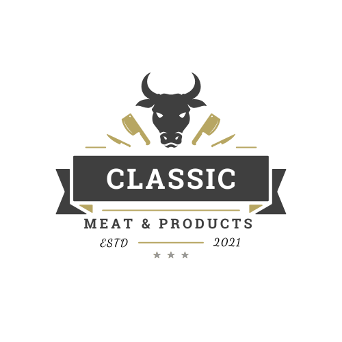

1. README.md File

This is the main file for your project's repository. It explains what the project is, what its features are, what technologies it uses, and how to set it up.
Create this file in the root directory of your project (e.g., butchersguide-clone/README.md)

Markdown


# Classic Meat & Products E-Commerce Platform



Welcome to Classic Meat & Products, a full-stack e-commerce website built for a premium online butcher shop. This application provides a seamless shopping experience for customers and a comprehensive admin panel for store owners to manage products, orders, and customers.

## ✨ Features

### Customer-Facing Website (Frontend)
- **Modern & Responsive Design**: Built with React and Tailwind CSS for a beautiful experience on any device.
- **Product Showcase**: View products grouped by categories on the Shop page.
- **Interactive Product Details**: Each product has its own page with a 3D model viewer.
- **Shopping Cart**: A fully functional cart with the ability to add, remove, and update item quantities.
- **Secure User Authentication**: Customers can register, log in, and manage their accounts.
- **Forgot/Reset Password**: A secure, token-based password reset flow via email.
- **Professional Order IDs**: Customer-friendly, unique order IDs (e.g., `ORD-20250917-A8C5E2`).
- **Checkout & Order Placement**: A smooth checkout process with billing details.
- **Customer Dashboard**: Users can view their order history and cancel pending orders.
- **Transactional Emails**: Automated, professional HTML emails for:
    - Order Confirmation
    - Order Delivered
    - Order Cancelled
    - Password Reset

### Administrative Panel (Backend)
- **Secure Admin Role**: The admin panel is protected and accessible only to users with an 'admin' role.
- **Product Management**: Create, read, update, and delete products, including stock management.
- **Category Management**: Easily add or remove product categories.
- **Order Management**: View all customer orders, update their status (Pending, Delivered, Cancelled), and view billing details.
- **Customer Management**: View a list of all registered customers.
- **Contact Form Submissions**: View messages submitted through the website's contact form.
- **Admin Email Notifications**: Admins receive email notifications for new orders and cancellations.

---

## 🛠️ Technology Stack

- **Frontend**:
    - **Framework**: React (with Vite)
    - **Styling**: Tailwind CSS
    - **Routing**: React Router
    - **HTTP Client**: Axios
    - **State Management**: React Context API
    - **3D Graphics**: React Three Fiber & Drei

- **Backend**:
    - **Framework**: FastAPI (Python)
    - **Database**: PostgreSQL
    - **ORM**: SQLAlchemy
    - **Authentication**: JWT (JSON Web Tokens) with OAuth2
    - **Email Service**: FastAPI-Mail with SendGrid for production.

- **Deployment**:
    - **Containerization**: Docker & Docker Compose

---

## 🚀 Getting Started

### Prerequisites
- Node.js & npm
- Python 3.10+
- PostgreSQL
- Docker (for deployment)

### 1. Backend Setup

```bash
# Navigate to the backend folder
cd backend

# Create and activate a virtual environment
python -m venv venv
venv\Scripts\activate  # On Windows
source venv/bin/activate # On Mac/Linux

# Install dependencies
pip install -r requirements.txt

# Create a .env file in the 'backend' folder and add your credentials
# (See .env.example for the required variables)

# Start the backend server
uvicorn app.main:app --reload


2. Frontend Setup


Bash


# Navigate to the frontend folder
cd frontend

# Install dependencies
npm install

# Create a .env file in the 'frontend' folder
# Add the following line, pointing to your backend API
VITE_API_URL=http://localhost:8000

# Start the frontend development server
npm run dev


3. Database Seeding

To populate your database with initial product and category data, run this command from the backend folder (with your venv activated) after starting the main server at least once to create the tables.

Bash


python -m app.seed_products


🐳 Deployment with Docker

This project is configured for easy deployment using Docker.
Configure Environment Variables: Fill in your production credentials in backend/.env and frontend/.env.
Build and Run: From the root directory of the project, run:
Bash
docker-compose up --build


This will build the images for the frontend, backend, and database, and run them as networked containers. The website will be accessible at http://localhost:5173.


<hr>

### 2. Docker Files for Deployment

Deploying a full-stack application can be complex. Docker simplifies this by "containerizing" each part of your project (frontend, backend, database), ensuring they run the same way everywhere.

#### **`Dockerfile` for the Backend**

**Create this file in your `backend` folder (e.g., `backend/Dockerfile`)**

```dockerfile
# Use an official Python runtime as a parent image
FROM python:3.10-slim

# Set the working directory in the container
WORKDIR /app

# Copy the requirements file into the container at /app
COPY ./requirements.txt /app/requirements.txt

# Install any needed packages specified in requirements.txt
RUN pip install --no-cache-dir --upgrade -r /app/requirements.txt

# Copy the rest of the application's code into the container
COPY ./app /app/app

# Command to run the application
CMD ["uvicorn", "app.main:app", "--host", "0.0.0.0", "--port", "8000"]


Dockerfile for the Frontend

Create this file in your frontend folder (e.g., frontend/Dockerfile)

Dockerfile


# Stage 1: Build the React application
FROM node:18 AS build

WORKDIR /app
COPY package*.json ./
RUN npm install
COPY . .
RUN npm run build

# Stage 2: Serve the built application with a lightweight web server
FROM nginx:stable-alpine
COPY --from=build /app/dist /usr/share/nginx/html

# When the container starts, nginx will serve the files
EXPOSE 80
CMD ["nginx", "-g", "daemon off;"]


docker-compose.yml (The Conductor)

This is the most important file for deployment. It tells Docker how to run your frontend, backend, and database together as a single service.
Create this file in the root directory of your project (e.g., butchersguide-clone/docker-compose.yml)

YAML


version: '3.8'

services:
  # Backend FastAPI Service
  backend:
    build: ./backend
    container_name: butcher-backend
    env_file:
      - ./backend/.env
    ports:
      - "8000:8000"
    depends_on:
      - db

  # Frontend React Service
  frontend:
    build: ./frontend
    container_name: butcher-frontend
    ports:
      - "5173:80" # Maps the container's port 80 to your computer's port 5173
    depends_on:
      - backend

  # PostgreSQL Database Service
  db:
    image: postgres:13
    container_name: butcher-db
    environment:
      POSTGRES_USER: postgres
      POSTGRES_PASSWORD: your_db_password # Change this!
      POSTGRES_DB: butchersguide
    volumes:
      - postgres_data:/var/lib/postgresql/data/
    ports:
      - "5432:5432"

volumes:
  postgres_data:


Before You Run: Make sure to replace your_db_password in the docker-compose.yml file with a strong password, and update your backend/.env file to match it.
With these files, you have a complete, professional setup for documenting, running, and deploying your entire e-commerce application.
